


 

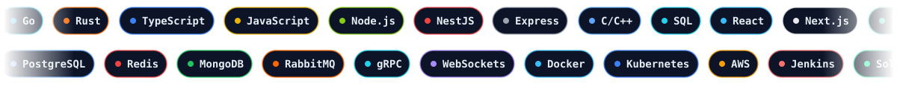

 
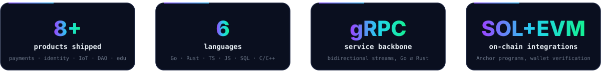

 

I'm a **backend engineer** who builds **scalable, secure, event-driven systems** with **Go** and **Node.js**, then pushes the trust-critical parts on-chain with **Rust and Solana**. I like problems where correctness, latency and security all matter at once: payment gateways, identity providers, IoT telemetry and decentralized infrastructure.




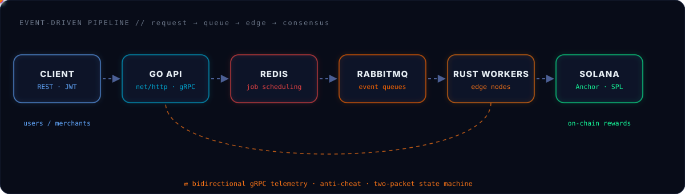


<a href="https://deping.xyz"></a>
<a href="https://kipay.xyz"></a>

<a href="https://breezonetwork.xyz"></a>
<a href="https://nid.xyz"></a>

<a href="https://paymentdao.vercel.app/"></a>
<a href="https://solana-minihack.vercel.app"></a>

<a href="https://www.exampaper.org"></a>
<a href="https://www.codenumber.net"></a>



| Period | Program | Institution |
|:--|:--|:--|
| **2023 – 2027** | B.Sc. Computer Science & Information Technology | Institute of Science and Technology, Tribhuvan University |
| **2020 – 2022** | +2 Science | Bluebird College, Kathmandu |


I'm open to backend, distributed systems and Web3 infrastructure roles.

