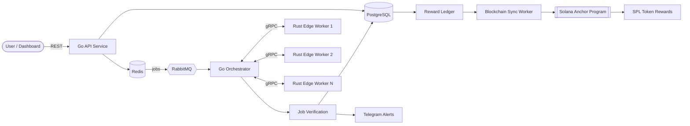

<!-- ===================== HEADER ===================== -->

 

  

Backend Development · Go · Node.js · Distributed Systems

---

## 🧠 About Me

I'm a **Backend Developer** based in Nepal, focused on building reliable backend services, APIs, and distributed systems.

I primarily work with **Go and Node.js**, with additional experience in **Python, Rust, databases, messaging systems, blockchain infrastructure, and applied AI**.

### 🛠️ Core Stack

| Area | Technologies |
| :--- | :--- |
| **Languages** | `Go` · `TypeScript` · `Python` · `Rust` |
| **Backend** | `Node.js` · `Express.js` · `NestJS` · `REST` · `gRPC` |
| **Data & Messaging** | `PostgreSQL` · `Redis` · `MongoDB` · `RabbitMQ` |
| **Applied AI** | `FastAPI` · `LangChain` · `LangGraph` · `RAG` · `AI Agents` |
| **Infrastructure** | `Docker` · `Linux` · `Nginx` · `Git` |

### 🎯 Interests

- **Backend Development** — Go, Node.js, APIs, distributed systems, and system design.
- **Distributed Systems** — Messaging, queues, state machines, concurrency, and reliable services.
- **Applied AI** — RAG systems, document intelligence, and agent-based workflows.
- **Blockchain Infrastructure** — Solana, smart contracts, wallets, and on-chain settlement.
- **Security** — Secure backend systems, authentication, cryptography, and application security.

---

## 🛠️ Tech Stack

**Languages**

**Backend & Data**

**Applied AI**

 

`RAG` · `AI Agents` · `Agentic AI`

**Frontend**

**Cloud & DevOps**

---

## 🚀 Featured Projects

<table>
<tr>

<td width="50%" valign="top">

### 📡 [DePing.xyz](https://deping.xyz)
**Distributed uptime monitoring network**

Go backend coordinating uptime checks across **Rust edge workers**.

- Built scalable Go microservices for distributed uptime monitoring.
- Implemented Redis scheduling, RabbitMQ queues and bidirectional gRPC telemetry.
- Developed job verification and anti-cheat mechanisms for monitoring results.
- Integrated Telegram alerts and Solana Anchor programs for SPL rewards.

`Go` `Rust` `gRPC` `RabbitMQ` `Redis` `PostgreSQL` `Solana`

</td>

<td width="50%" valign="top">

### 🤖 [AI Document Intelligence](https://github.com/everestp/Document-Intelligence)
**Document processing, RAG and AI agents**

End-to-end AI backend for transforming unstructured documents into structured information.

- Built PDF ingestion, extraction, cleaning, chunking and structured data pipelines.
- Implemented embeddings, vector retrieval and ChromaDB semantic search.
- Developed RAG-based document Q&A and LLM-powered agent workflows.
- Exposed AI workflows through FastAPI with Pydantic validation and React integration.

`Python` `FastAPI` `RAG` `LangGraph` `ChromaDB` `Pydantic` `React`

</td>
</tr>

<tr>

<td width="50%" valign="top">

### 💳 [Kipay.xyz](https://kipay.xyz)
**Non-custodial crypto payment gateway**

High-performance Go payment infrastructure using a modular monolith architecture.

- Built the backend in Go using native `net/http` for payment processing.
- Developed a Rust multi-currency verification engine communicating through bidirectional gRPC.
- Implemented merchant administration, payment links and hosted checkout workflows.
- Designed PostgreSQL settlement flows with signed webhooks and transaction state tracking.

`Go` `Rust` `gRPC` `React` `PostgreSQL`

</td>

<td width="50%" valign="top">

### 🪪 [Nid.xyz](https://nid.xyz)
**Handle-based identity provider**

Go identity infrastructure providing a unified handle across connected applications.

- Built a scalable Go identity provider for handle-based authentication.
- Implemented OAuth 2.0, OpenID Connect and PKCE authorization flows.
- Developed `.nid` handle claiming and resolution with EVM and Solana wallet verification.
- Implemented centralized session management with active-session revocation.

`Go` `React` `TypeScript` `OAuth 2.0` `OIDC` `PKCE` `PostgreSQL` `Solana`

</td>
</tr>

<tr>

<td width="50%" valign="top">

### 🌬️ [Breezonetwork.xyz](https://breezonetwork.xyz)
**Air-quality monitoring network · Founding Engineer**

Real-time IoT backend ingesting telemetry from distributed ESP32 sensor nodes.

- Built the Node.js backend for real-time ESP32 air-quality telemetry ingestion.
- Implemented low-latency Socket.IO streaming for sub-second sensor updates.
- Secured device communication using NaCl cryptography and replay protection.
- Developed Solana Anchor programs for node registration, SPL rewards and access control.

`Node.js` `TypeScript` `MongoDB` `Socket.IO` `ESP32` `Solana` `Anchor`

</td>

<td width="50%" valign="top">

### 🏛️ [PayDAO](https://paymentdao.vercel.app/)
**Realtime DAO treasury governance**

Realtime governance infrastructure built with **MagicBlock Ephemeral Rollups**.

- Built permissionless groups, proposals and member voting.
- Implemented duplicate-vote protection using `VoteReceipt` state.
- Developed treasury reservation and automatic execution workflows.
- Implemented atomic commit and undelegation for durable settlement to Solana.

`Rust` `Anchor` `Solana` `MagicBlock` `React`

</td>
</tr>

<tr>

<td width="50%" valign="top">

### 🧩 [Godec.xyz](https://solana-minihack.vercel.app)
**On-chain applications with wallet ownership**

Solana platform for building applications around wallet-based ownership.

- Implemented wallet-based authentication.
- Built on-chain Todo functionality.
- Developed on-chain Notes functionality.
- Developed on-chain Voting functionality.

`Rust` `Solana` `React`

</td>

<td width="50%" valign="top">

### 📚 [ExamPaper.org](https://www.exampaper.org)
**Exam prep and academic resources**

Academic platform for structured exam preparation and resource management.

- Implemented role-based authentication.
- Built mock tests and an exam resource library.
- Added search and filtering for academic resources.
- Implemented resource management using Appwrite-backed storage.

`Appwrite` `TypeScript` `React`

</td>
</tr>

<tr>

<td width="50%" valign="top">

### 💻 [CodeNumber.net](https://www.codenumber.net)
**TU-syllabus coding education platform**

Interactive coding platform focused on structured, syllabus-aligned learning.

- Built in-browser coding functionality using the Monaco editor.
- Structured learning content around the TU syllabus.
- Implemented authentication for platform users.
- Integrated Appwrite for application data and storage.

`Appwrite` `TypeScript` `React` `Monaco Editor`

</td>

<td width="50%" valign="top">

</td>

</tr>
</table>

---

## 🏗️ Architecture Spotlight: DePing

---

## 📊 GitHub Analytics

---

## 🐍 Contribution Snake

  

---

## 🎓 Education

| Period | Program | Institution |
|:--|:--|:--|
| **2023 – 2027** | B.Sc. Computer Science & Information Technology | Institute of Science and Technology, Tribhuvan University |
| **2020 – 2022** | +2 Science | Bluebird College, Kathmandu |

---

## 🔐 What I Care About

- **Correctness under load:** idempotency, state machines, replay protection
- **Security by default:** OWASP Top 10, cryptographic verification, least privilege
- **Reliable infrastructure:** containers, queues and clear failure modes
- **Practical architecture:** simple systems that are observable, maintainable and scalable

---

## 🤝 Let's Connect

I'm open to **backend development, distributed systems and infrastructure opportunities**.

  

> **"Great backend systems are invisible until they fail."**

