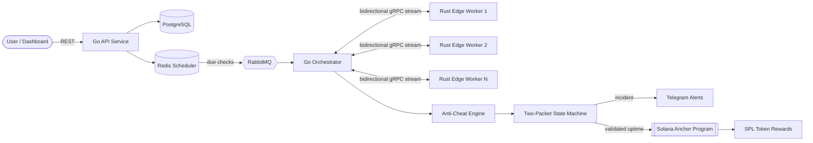

<!-- ===================== HEADER ===================== -->

 

  

Backend Engineering · Go · Node.js · Blockchain · Applied AI

---

## 🧠 About Me

I'm a computer science student (B.Sc. CSIT, Tribhuvan University) and **backend developer** based in Nepal. I love building practical systems that work reliably under the hood—focusing on backend services, AI integrations, and core blockchain technologies. 

### 🛠️ Core Stack

| Category | Technologies |
| :--- | :--- |
| **Languages** | `Go`, `Node.js`, `TypeScript` |
| **Backend & Messaging** | `Express.js`, `NestJS`, `gRPC`, `RabbitMQ`, `REST APIs` |
| **Databases** | `PostgreSQL`, `Redis`, `MongoDB` |
| **Tools & Infrastructure** | `Docker`, `Git`, `Linux`, `Nginx` |

---

### 🎯 What I Focus On

* **⚙️ Backend Engineering:** Building clean APIs, microservices, and reliable server-side logic using Go and Node.js.
* **🤖 AI Integration:** Experimenting with AI-powered backend workflows and RAG systems.
* **🪙 Blockchain:** Interested in Bitcoin technology, peer-to-peer networks, and privacy-focused blockchain systems like Monero and Zcash.
---

## 🛠️ Tech Stack

**Languages**

**Backend & Data**

**Applied AI**

 

`RAG` · `AI Agents` · `Agentic AI`

**Frontend**

**Cloud & DevOps**

---

## 🚀 Featured Projects

<table>
<tr>
<td width="50%" valign="top">

### 📡 [DePing.xyz](https://deping.xyz)
**Decentralized uptime monitoring network**

Go microservices manage distributed uptime checks across **Rust edge workers**, with Redis scheduling, RabbitMQ queues and bidirectional gRPC telemetry.

- Two-Packet state machine to kill false alarms
- Anti-cheat engine validating node reports
- Real-time Telegram alerts
- Solana Anchor contracts for SPL token rewards

`Go` `Rust` `gRPC` `RabbitMQ` `Redis` `PostgreSQL` `Solana`

</td>
<td width="50%" valign="top">

### 💳 [Kipay.xyz](https://kipay.xyz)
**Non-custodial crypto payment gateway**

High-performance Go backend (modular monolith on native `net/http`) paired with a **Rust multi-currency verification engine** over bidirectional gRPC.

- Merchant admin, payment links, hosted checkout
- Settlement engine and signed webhooks
- Real-time transaction state tracking
- Full React frontend

`Go` `Rust` `gRPC` `React` `PostgreSQL`

</td>
</tr>
<tr>
<td width="50%" valign="top">

### 🌬️ [BREEZO Network](https://breezonetwork.xyz)
**Decentralized air-quality monitoring** (founding engineer)

Ingests live telemetry from **ESP32 IoT sensors** and streams sub-second updates to dashboards via Socket.IO.

- NaCl-secured device communication
- Strict replay protection against data injection
- Solana node registration, SPL rewards, access control

`Node.js` `TypeScript` `MongoDB` `Socket.IO` `ESP32` `Solana`

</td>
<td width="50%" valign="top">

### 🪪 [NID.xyz](https://nid.xyz)
**Handle-based decentralized identity provider**

A Go identity provider giving users one handle across connected apps, built on **OAuth 2.0, OpenID Connect and PKCE**.

- `.nid` handle claiming and resolution
- EVM and Solana wallet ownership verification
- Central session management and instant revocation
- Connected-app dashboard

`Go` `React` `TypeScript` `OAuth2` `OIDC` `PostgreSQL` `Solana`

</td>
</tr>
<tr>
<td width="50%" valign="top">

### 🏛️ [PayDAO](https://paymentdao.vercel.app/)
**Realtime DAO treasury governance on Solana**

Powered by **MagicBlock Ephemeral Rollups**: delegated realtime governance with programmable treasury execution and durable on-chain settlement.

- Permissionless groups, proposals and member voting
- Duplicate-vote protection with `VoteReceipt` state
- Treasury reservation and automatic execution
- Atomic commit / undelegate back to Solana

`Rust` `Anchor` `Solana` `MagicBlock` `React` `TypeScript`

</td>
<td width="50%" valign="top">

### 🧩 [Godec.xyz](https://solana-minihack.vercel.app)
**On-chain apps with wallet-based ownership**

A Solana Web3 platform with censorship-resistant data ownership.

- Wallet-based authentication
- On-chain Todo, Notes and Voting apps

`Rust` `Solana` `React`

</td>
</tr>
<tr>
<td width="50%" valign="top">

### 📚 [ExamPaper.org](https://www.exampaper.org)
**Exam prep and academic resources**

- Role-based authentication
- Mock tests and exam library
- Search, filtering and resource management

`Appwrite` `TypeScript` `React`

</td>
<td width="50%" valign="top">

### 💻 [CodeNumber.net](https://www.codenumber.net)
**TU-syllabus coding education platform**

- In-browser coding with Monaco editor
- Structured, syllabus-aligned learning
- Authentication and storage

`Appwrite` `TypeScript` `React`

</td>
</tr>
</table>

---

## 🏗️ Architecture Spotlight: DePing

---

## 📊 GitHub Analytics

---

## 🐍 Contribution Snake

  

---

## 🎓 Education

| Period | Program | Institution |
|:--|:--|:--|
| **2023 – 2027** | B.Sc. Computer Science & Information Technology | Institute of Science and Technology, Tribhuvan University |
| **2020 – 2022** | +2 Science | Bluebird College, Kathmandu |

---

## 🔐 What I Care About

- **Correctness under load:** idempotency, state machines, replay protection
- **Security by default:** OWASP Top 10, cryptographic verification, least privilege
- **Boring, observable infrastructure:** containers, queues and clear failure modes
- **Trust-minimized design:** wallets, signatures and on-chain settlement where they actually help

---

## 🤝 Let's Connect

I'm open to backend, distributed systems and Web3 infrastructure opportunities.

  

> **"Great backend systems are invisible until they fail. My job is to make sure they never do."**

